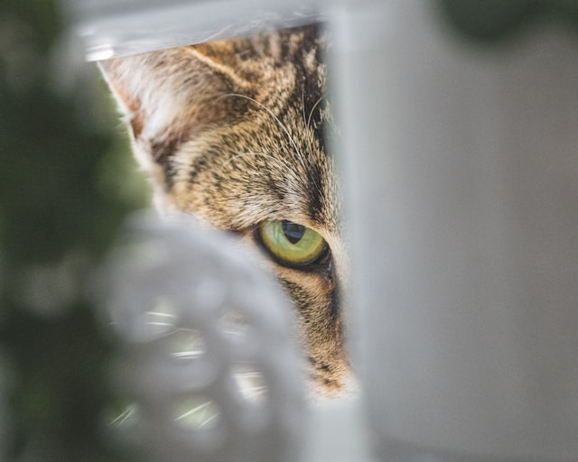

# Home Automation and Keeping your Data Private

A presentation on tips and tricks for home automation that protects your personal data and doesn't lock you into an ecosystem


---

# What Can Companies Gather of Value From You?

- ISPs can gather DNS lookups and sell for advertising
- ISPs can inject ads and redirect services
- Home Automation hubs can gather behavior data
- Home Automation hubs can access sensitive devices
- Local Networks can be vulnerable from poorly secured IoT Devices



---

# Why Would They Try to Lock You Into Their System?

- Force you to buy their products
- More data is more valuable
- Force third parties to accept their terms


---

# Companies Maliciously Change APIs

- **MyQ**: Changed API access, breaking third-party integrations
- **Life360**: Restricted API access to location data
- **Ecobee**: Modified API terms, limiting developer access

#### Why did the company bring a ladder to the meeting?
#### To reach new lows in customer service!

---

# Real-world Security Concerns

## Recent Smart Home Security Incidents

- **2024**: [Wyze data breach](https://www.theverge.com/2024/2/19/24077233/wyze-security-camera-breach-13000-customers-events) exposed 13K customers' personal data
- **2023**: [Eufy camera breach exposed user videos](https://www.theverge.com/23573362/anker-eufy-security-camera-answers-encryption) to unauthorized users
- **2022**: [Insteon shutdown](https://staceyoniot.com/the-end-of-insteon-and-why-the-smart-home-keeps-faltering/) left users with non-functional smart home devices
- **2021**: [Chinese/Russian IoT devices sending data](https://www.zscaler.com/blogs/security-research/new-insights-china-watching-your-iot-traffic) to servers without user consent

#### Why don't smart homes keep secrets well?
#### Because their walls have IoT ears!

---

# What Can You Do About It?

## Protect Internet Usage

- VPNs?
- Host your own DNS with PiHole and Unbound
- Block ads and malicious content with DNS filtering

#### Why do VPN ads feel like a broken record?
#### Because they keep buffering the same pitch!

---

# DNS Protection Example

## PiHole Configuration

### Primary & Secondary DNS Setup
- dns-00.service.burdick.dev
- dns-01.service.burdick.dev

### Block lists I recommend:
- https://raw.githubusercontent.com/StevenBlack/hosts/master/hosts
- https://blocklistproject.github.io/Lists/alt-version/smart-tv-nl.txt
- https://gist.githubusercontent.com/hkamran80/779019103fcd306979411d44c8d38459/raw/3c168e68f067f00df825c73042255e6d3fd541c4/SmartTV2.txt
- https://raw.githubusercontent.com/crazy-max/WindowsSpyBlocker/master/data/hosts/spy.txt
- https://blocklistproject.github.io/Lists/tiktok.txt

#### Why did the pie go to the dentist?
#### It needed a filling!

---

# DNS Protection Diagram: Bypassing ISP Surveillance

```
┌───────────────────────┐                 ┌───────────────────────┐
│                       │                 │                       │
│  Your Home Devices    │                 │    Root DNS Servers   │
│                       │                 │                       │
└───────────┬───────────┘                 └───────────┬───────────┘
            │                                         │
            │ DNS Queries                             │
            ▼                                         │
┌─────────────────────────┐                           │
│                         │                           │
│  Unifi Gateway          │                           │
│                         │                           │
└───────────┬─────────────┘                           │
            │                                         │
            │ Redirect all DNS                        │
            │ queries (port 53)                       │
            ▼                                         │
┌─────────────────────────────────────────┐           │
│                                         │           │
│  Local PiHole DNS Servers               │           │
│  ┌─────────────────┐ ┌─────────────┐    │           │
│  │    Primary      │ │  Secondary  │    │           │
│  │                 │ │             │    │  Encrypted DNS
│  │ dns-00.service. │ │ dns-01.serv │    │  Queries (DoT/DoH)
│  │ burdick.dev     │ │ ice.burdick │    │           │
│  └────────┬────────┘ └─────┬───────┘    │           │
│           │                │            │           │
│           └────────┬───────┘            │           │
│                    │                    │           │
│        ┌───────────▼──────────┐         │           │
│        │                      │         │           │
│        │  Unbound Resolver    │◄────────┼───────────┘
│        │  (Local recursive    │         │
│        │   DNS resolver)      │         │
│        └──────────────────────┘         │
│                                         │
└─────────────────────────────────────────┘
            │
            │            ┌──────────────────────────┐
            │            │                          │
            │            │  ISP DNS Servers         │
            │            │                          │
            └────────────►  (Bypassed completely,   │
                         │   can't see your DNS     │
                         │   lookups or browsing)   │
                         │                          │
                         └──────────────────────────┘
```

#### Why did the DNS server start therapy? It had too many unresolved issues!

---

# Network Segregation

- Create separate network for IoT Devices
- Block/Control what IoT devices can get to
- Keep sensitive devices on a protected network

#### Why did the IoT device get therapy?
#### It had trouble with boundaries!

---

# Network Segregation Diagram

```
┌────────────────────┐      ┌────────────────────┐
│                    │      │                    │
│   Main Network     │      │   IoT Network      │
│                    │      │                    │
│ ┌───────────────┐  │      │ ┌───────────────┐  │
│ │ PCs/Phones    │  │      │ │ Smart Devices │  │
│ │ Critical Data │  │      │ │ Sensors       │  │
│ └───────────────┘  │      │ └───────────────┘  │
└──────────┬─────────┘      └────────┬───────────┘
           │                         │
           │                         │
           ▼                         ▼
    ┌────────────────────────────────────┐
    │                                    │
    │ Unifi Gateway                      │
    │                                    │
    │ ┌──────────────────────────────┐   │
    │ │ Firewall Rules:              │   │
    │ │ - IoT → Internet: ✓          │   │
    │ │ - IoT → Main Network: ✗      │   │
    │ │ - Main → IoT (specific): ✓   │   │
    │ └──────────────────────────────┘   │
    └────────────────┬───────────────────┘
                     │
                     ▼
              ┌─────────────┐
              │             │
              │  Internet   │
              │             │
              └─────────────┘
```

#### What's a firewall's favorite exercise? Setting boundaries!

---

# Agnostic Home Automation Systems

- **Home Assistant**: Open-source platform with wide device support
- **Hubitat**: Local processing without cloud dependency
- **Homey**: Closed-source cloud/local hybrid

#### Why did the smart home throw a party?
#### It wanted to make everyone feel right at "home" with automation!

---

# Home Assistant Automations

## Privacy-first automation example

```yaml
alias: Porch Lights - Person Detected
description: Turn on the porch lights when a person is detected
triggers:
  - entity_id:
      - binary_sensor.front_door_person_detected
    to: "on"
    trigger: state
conditions:
  - condition: time
    after: "23:00:00"
    before: "06:30:00"
    enabled: true
  - condition: state
    entity_id: binary_sensor.front_door_is_dark
    state: "on"
    enabled: false
actions:
  - data: {}
    target:
      entity_id:
        - light.front_porch_left_bulb
        - light.front_porch_right_light
    action: light.turn_on
  - delay:
      hours: 0
      minutes: 2
      seconds: 0
      milliseconds: 0
  - data: {}
    target:
      entity_id:
        - light.front_porch_left_bulb
        - light.front_porch_right_light
    action: light.turn_off
mode: single
```

#### Why is Home Assistant like a good comedian?
#### It has great local timing!

---

# Use Non-Internet Connected Devices

| Protocol | Pros | Cons | Best For |
|----------|------|------|----------|
| **Zigbee** | Low power, mesh network, widely adopted | Interference on 2.4GHz, vendor quirks | Sensors, lights, switches |
| **Z-Wave** | Dedicated spectrum, standardized | More expensive, limited range | Locks, critical devices |
| **ESPHome** | Fully customizable, local control | DIY effort, power hungry | Custom sensors, displays |
| **Wi-Fi** | No hub needed, high bandwidth | Power hungry, security concerns | Cameras, displays, high-data devices |

#### I was going to make a joke about wireless protocols, but it didn't have good reception.

---

# Build Your Own Devices

- **ESP32 + ESPHome**: Create custom smart devices
- **ratgdo32 vs MyQ**: Open alternatives to proprietary systems
- Take control of your own hardware and software


#### Why did the dog build its own house?
#### Because it wanted a "ruff" over its head!

---

# ESPHome Example: Simple Motion Sensor

```yaml
# motion_sensor.yaml
esphome:
  name: hallway_motion
  friendly_name: Hallway Motion Sensor

esp32:
  board: esp32dev

wifi:
  networks:
  - ssid: "IoT_Devices"
    password: !secret wifi_password

# Enable Home Assistant API
api:
  encryption:
    key: !secret api_encryption_key

sensor:
  - platform: gpio
    pin: GPIO27
    name: "Hallway Motion"
    device_class: motion
    filters:
      - delayed_off: 30s
```

#### What did the ESP32 say to the cloud service?
#### "Wire you trying to control me?"

---

# Where Do I Start?

## Start with internet-based smart homes
- Google Home
- Apple HomeKit
- Amazon Alexa


#### Why did the dog love smart home automation?
#### It made life paws-itively easy!

---

# Moving to Open Source

- VM on spare computer
- Home Assistant Green or Yellow
- Raspberry Pi


#### Why did the open-source project break up with its proprietary partner?
#### It needed more freedom to commit!
---

# Migration Path: Breaking Free

```
Commercial Systems → Home Assistant → Full Local Control
   ↓                     ↓                    ↓
Alexa/Google     →  HA Yellow/VM   →    Advanced Setups
   ↓                     ↓                    ↓
Cloud APIs       →  Local APIs      →    Custom Firmware
   ↓                     ↓                    ↓
Vendor Lock-in   →  Mixed Ecosystem →    Full Freedom
```

#### How is migrating to open-source home automation like learning to swim?
#### You start in the shallow end before diving into the deep!

---

# Pick One Radio Type (For Now)

- Zigbee for low power devices
- Consider expansion options for future growth
- Start small and build your system gradually


#### Why don't bees use Wi-Fi?
#### Because they prefer to stay in their own buzz-network!

---

# Helpful Resources

## Where to Find Privacy-Focused Home Automation Help

- **Communities**:
  - [Home Assistant Community](https://community.home-assistant.io/)
  - [r/homeassistant](https://www.reddit.com/r/homeassistant/)
  - [Everything Smart Home](https://www.youtube.com/@EverythingSmartHome) (YouTube)
  - [Home Automation Guy](https://www.youtube.com/@HomeAutomationGuy) (YouTube)

- **Documentation**:
  - [Home Assistant Docs](https://www.home-assistant.io/docs/)
  - [ESPHome Guides](https://esphome.io/guides/)
  - [PiHole Wiki](https://docs.pi-hole.net/)

#### Why are home automation enthusiasts great at relationships?
#### They always know how to make proper connections!

---

# Conclusion

- Protect your personal data
- Avoid vendor lock-in
- Build a system that serves YOUR needs
- Take control of your smart home


#### Why did the smart home enthusiast regret their decision?
#### Because they didn't have the bandwidth to think it through!

---

# Questions?

Thank you for your attention!


#### Why don't skeletons ask questions?
#### Because they might not like the answers—they don't have the guts!

---

# Attributions

- Photo by [joey senft](https://unsplash.com/@jsenftphotography) on [Unsplash](https://unsplash.com/photos/brown-wooden-house-near-fire-TSmGF2Yx9mk)
- Photo by [Y S](https://unsplash.com/@santonii) on [Unsplash](https://unsplash.com/photos/brown-tabby-cat-in-white-plastic-container-1cp55ddy2wU)
- Photo by [Lucas van Oort](https://unsplash.com/@switch_dtp_fotografie) on [Unsplash](https://unsplash.com/photos/gray-scale-photo-of-chain-link-fence-b-PuyK1_A60)
- Photo by [Taylor Deas-Melesh](https://unsplash.com/@taylor_deas_melesh) on [Unsplash](https://unsplash.com/photos/black-and-white-short-coated-dog-biting-brown-wooden-stick-TqTjjl4kwP4)
- Photo by [Ken Friis Larsen](https://unsplash.com/@danish_curator) on [Unsplash](https://unsplash.com/photos/black-and-white-striped-flag-na-474S3EHk)
- Photo by [Ignacio Amenábar](https://unsplash.com/@amenabarladrondeguevara) on [Unsplash](https://unsplash.com/photos/dog-leaning-his-head-on-car-window-2dkgXTfPfTg)
- Photo by [Luke Southern](https://unsplash.com/@lukesouthern) on [Unsplash](https://unsplash.com/photos/open-led-signage-4kCGEB7Kt4k)
- Photo by [Vladislav Babienko](https://unsplash.com/@garri) on [Unsplash](https://unsplash.com/photos/man-standing-in-the-middle-of-woods-KTpSVEcU0XU)
- Photo by [Camylla Battani](https://unsplash.com/@camylla93) on [Unsplash](https://unsplash.com/photos/short-coated-brown-dog-AoqgGAqrLpU)

